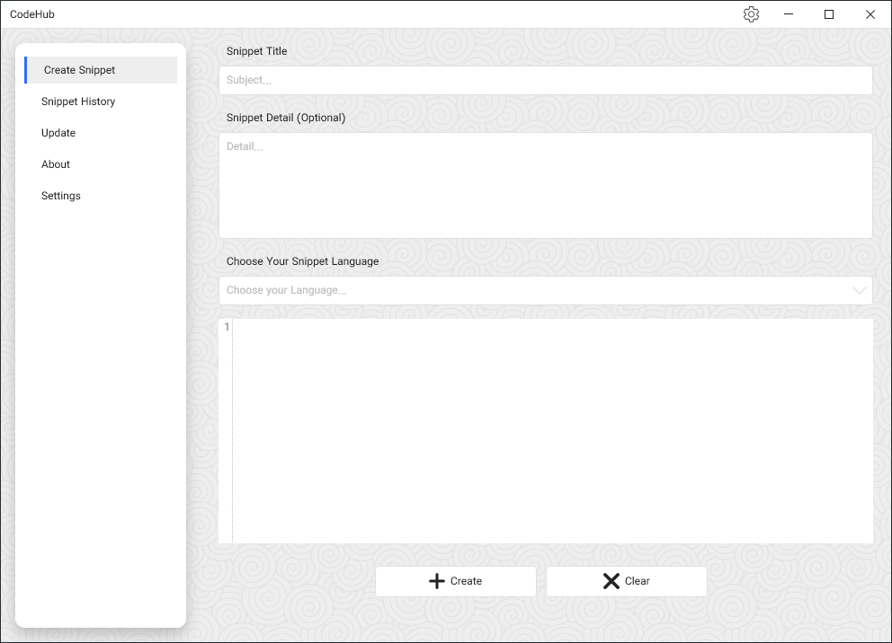
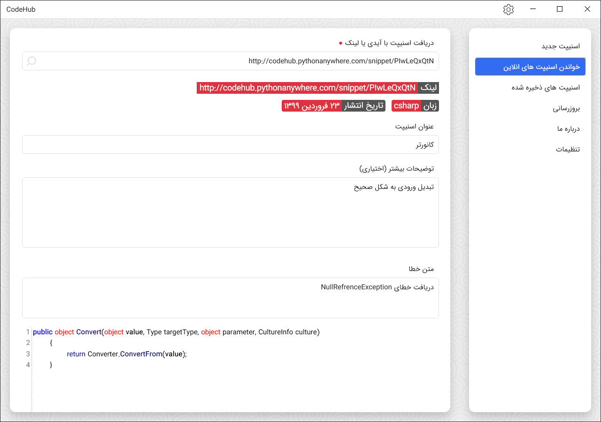

# CodeHubDesktop

CodeHub is a platform for archiving the errors, bugs, and scripts you intend to share with others.
This App work with CodeHub API services.

- Prism MVVM
- EntityFrameWorkCore
- .Net Core 3.1

